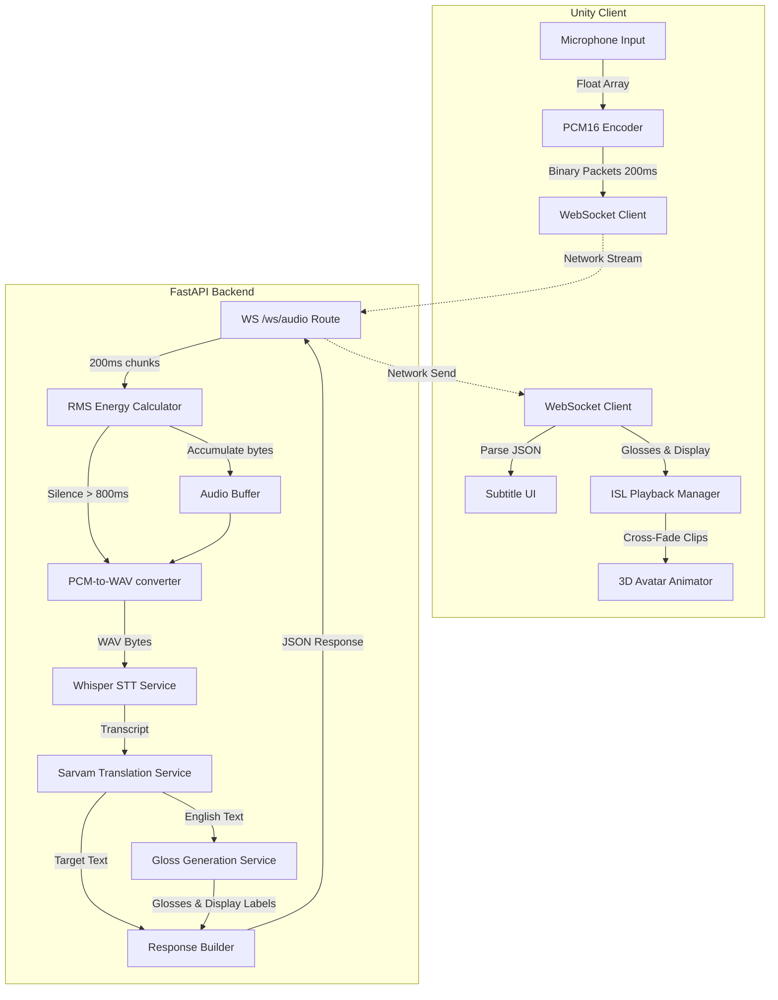
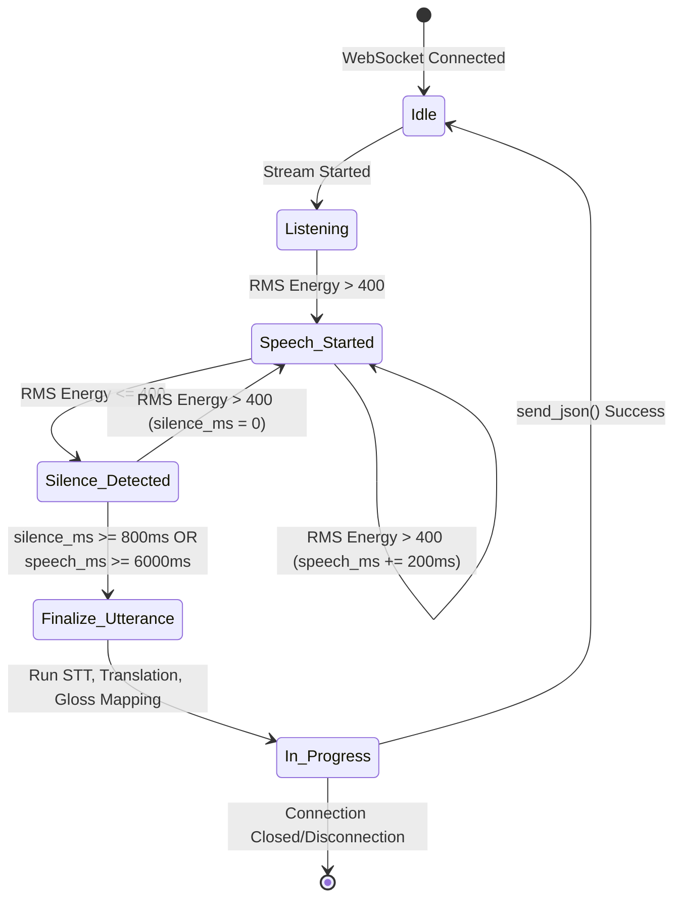
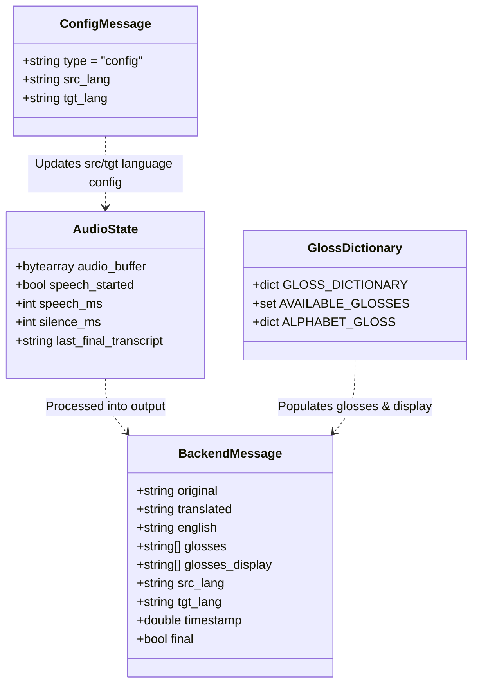

# ConverseNow: Final Project Report
### Real-Time Assistive Translation and Indian Sign Language (ISL) Interpretation System

---

## Table of Contents
1. [Executive Summary & Project Synopsis](#1-executive-summary--project-synopsis)
2. [Software Requirements Specification (SRS)](#2-software-requirements-specification-srs)
3. [System Architecture & Design Document (SADD)](#3-system-architecture--design-document-sadd)
4. [Technical Implementation Details](#4-technical-implementation-details)
5. [Testing & Validation Report](#5-testing--validation-report)
6. [Team Contributions & Project Roles](#6-team-contributions--project-roles)

---

## 1. Executive Summary & Project Synopsis

### 1.1 Abstract
Communication between hearing-impaired individuals who use sign language and the vocal majority remains a significant accessibility barrier. This gap is especially pronounced in multilingual societies like India, where regional dialects add complexity. 

**ConverseNow** is an end-to-end, low-latency assistive system that bridges this gap. It captures vocal speech in English or one of 10 regional Indian languages, transcribes and translates it, generates corresponding Indian Sign Language (ISL) glosses, and plays the matching animations on a 3D avatar client in real time. 

By employing local Speech-to-Text inference and a robust cascade mapping dictionary with automatic fingerspelling fallbacks, the system provides a responsive, offline-capable tool for assistive communication.

### 1.2 Problem Statement & Motivation
* **Communication Gap**: Signing individuals cannot easily communicate with non-signing individuals in daily public spaces (hospitals, banks, transit stations).
* **Multilingual Complexity**: Standard sign translation systems are built primarily for English. An assistive tool in India must support regional scripts (Hindi, Tamil, Telugu, etc.).
* **Technical Latency**: Existing translation pipelines require waiting for an entire audio recording to finish before starting processing, making conversation feel unnatural.

### 1.3 Scope & Technology Stack
* **Client App**: Unity 6, TextMeshPro, C# WebSockets.
* **Server Backend**: Python 3.8+, FastAPI, Uvicorn (ASGI).
* **Inference Models**: Local OpenAI Whisper (`small` model), PyTorch.
* **Translation APIs**: SarvamAI REST Client API (`sarvam-translate:v1`).
* **Supported Languages**: English (`en-IN`), Hindi (`hi-IN`), Marathi (`mr-IN`), Telugu (`te-IN`), Tamil (`ta-IN`), Kannada (`kn-IN`), Malayalam (`ml-IN`), Bengali (`bn-IN`), Gujarati (`gu-IN`), Punjabi (`pa-IN`), Urdu (`ur-IN`).

---

## 2. Software Requirements Specification (SRS)

### 2.1 System Requirements & Environment Constraints
* **Operating System**: Windows 10/11 or Ubuntu Linux.
* **Python Runtime**: Python 3.8+ (tested on Python 3.13).
* **System Utilities**: **FFmpeg** installed and added to the System PATH (required for Whisper audio decoding).
* **Machine Learning Runtime**: PyTorch (with CUDA enabled for GPU-based fast Whisper inference).
* **Client Runtime**: Unity 6 Editor (or stand-alone builds).

### 2.2 Functional Requirements (FR)
* **FR-1: Real-Time Audio Streaming**: The client must capture microphone input at 16kHz, Mono, 16-bit PCM and stream it in small buffers (200ms) to the server via WebSockets.
* **FR-2: Intelligent Utterance Segmentation**: The server must calculate the signal energy (RMS) and segment an utterance when silence (energy $< 400$) is detected for more than 800ms following active speech, or when active speech reaches 6000ms.
* **FR-3: Multilingual Transcription & Validation**: The server must transcribe speech in English and 10 regional Indian scripts using local Whisper inference and reject noise/ASCII transcripts when an Indic regional script was expected.
* **FR-4: API-Based Text Translation**: The server must translate the finalized transcription into the target language requested by the client (for subtitles) and English (for gloss mapping).
* **FR-5: Cascade Gloss Translation**: The system must map English text into a sequence of ISL glosses using a cascading match checklist:
  * Omit grammatical stop words (e.g., `"is"`, `"to"`, `"the"`).
  * Match exact dictionary terms.
  * Match sub-words/substrings (length $\ge$ 3).
  * Match similar terms (similarity score $\ge$ 0.75).
  * Spell out remaining proper nouns/unrecognized words letter-by-letter.
* **FR-6: Synchronized Animation Playback**: The Unity client must parse the backend JSON payload, play back corresponding animation clips in sequence matching exact durations, and display the corresponding gloss label (e.g., `"HELLO"` or `"Fingerspelled-WORLD"`) in real time.

### 2.3 Non-Functional Requirements (NFR)
* **NFR-1: Performance & Latency**: The system must finalize translation and return the JSON response in less than 1.5 seconds from the time the user stops speaking.
* **NFR-2: Thread Safety & Concurrency**: The backend must use thread-pool execution (`asyncio.to_thread`) for blocking operations so that the event loop can handle heartbeats and concurrent socket events.
* **NFR-3: Fault Tolerance & Graceful Degradation**: If the SarvamAI API translation key is missing or invalid, the backend must catch the failure, log it, and return the original transcript to keep the WebSocket stream running.

---

## 3. System Architecture & Design Document (SADD)

### 3.1 High-Level Data Flow & Pipeline Architecture
The diagram below maps out how raw vocal input from the Unity client is transformed, analyzed, and processed into sign animations.

---

## 3.2 Speech Activity & Connection State Machine
The backend operates a state-driven WebSocket consumer. The diagram below illustrates how audio segments are identified and sent for translation.

---

## 3.3 Data Models & JSON Payload Schemas (ER-Equivalent)
Since ConverseNow is a stateless translation pipeline, there is no physical SQL/NoSQL database storage. The diagram below represents the logical schema and relationship of the in-memory variables and WebSocket serialization classes.

---

## 4. Technical Implementation Details

### 4.1 Entry Router & WebSocket Handler (`main.py`)
* Manages Client WebSocket connections at `/ws/audio`.
* **Speech Activity Detection (SAD)**: Calculates Root Mean Square (RMS) energy on incoming 200ms chunks using `rms_pcm16`.
* **Utterance Segmentation**: Finalizes the buffer when silence is detected for more than `800ms` (following at least `800ms` of active speech) or when the utterance hits a maximum duration of `6000ms`.
* **Async Thread Offloading**: Runs heavy operations (STT, translation, gloss generation) via `asyncio.to_thread` to ensure the main ASGI event loop is never blocked.

### 4.2 Speech-to-Text (`stt_service.py`)
* Wraps the local **OpenAI Whisper** model.
* **Decoding Optimization**: Utilizes language-specific prompt steering (e.g., feeding native script templates as initial prompts) and parameter overrides (beam size, logprob, and no-speech cutoffs) to improve transcription accuracy.
* **Script Verification**: Validates the Unicode block ranges of the output text against the target language to prevent Whisper from outputting ASCII characters/noise in place of native regional scripts.

### 4.3 Translation Service (`translation_service.py`)
* Integrates with the **SarvamAI Translation API** (`sarvam-translate:v1`).
* Translates the transcription to the target language and also to English (used as the base language for sign mapping).
* Implements dynamic API fail-safe caching to gracefully bypass the translation step if the API key is invalid or expires.

### 4.4 Gloss Translation Service (`gloss_generation_service.py`)
* Resolves the English translation into a list of animation names.
* **Stop Word Omission**: Removes words like `"is"`, `"the"`, `"to"` which carry no semantic weight in sign language.
* **Cascading Logic**:
  1. *Exact match* in local dictionary.
  2. *Substring match* (restricted to keys $\ge$ 3 characters).
  3. *Similarity mapping* (using `difflib.SequenceMatcher` with a strict threshold $\ge$ 0.75).
  4. *Fingerspelling fallback*: Spells out unrecognized words character-by-character.

---

## 5. Testing & Validation Report

### 5.1 Unit Testing Setup
The backend contains two automated test suites designed to validate transcription filters and mapping algorithms offline:
* **`test_gloss_generation.py`**: Validates word cleaning, tokenization, synonym mapping, similarity matching, fingerspelling fallbacks, and coverage metrics.
* **`test_whisper_indic.py`**: Validates prompt settings, decoding parameters, and Unicode-based script verification logic.

### 5.2 Test Execution & Verification Results
* **Gloss Mapping Engine (`test_gloss_generation.py`)**: **✓ 100% Passed**. All word mappings, custom aliases (like `"hi"`/`"hey"` $\rightarrow$ `"hello"`, `"house"` $\rightarrow$ `"home"`), stop-word cleanups, and fingerspelling fallbacks matched expectations.
* **Indic Speech Transcription & Validation (`test_whisper_indic.py`)**: **✓ 100% Passed**. Whisper model initialized successfully (`small` model), script prompts generated correctly, and script-native validations (Devanagari, Telugu, Tamil, etc.) succeeded.

### 5.3 Real-Time Diagnostic Testing
To verify hardware and environment parameters, a diagnostic volume monitor was added to the WebSocket endpoint:
* **Feature**: Outputs current voice input energy (`rms`) and recording state to the console every 200ms:
  `🎙️ Volume: 480 | Speech Started: True`
* **Result**: Verified that the segmentation logic divides voice segments accurately, preventing audio clipping.

---

## 6. Team Contributions & Project Roles

### 6.1 Aditya (Backend & Machine Learning Services)
* **Real-Time WebSocket Server**: Developed the FastAPI event-driven WebSocket backend at `/ws/audio` to ingest binary PCM16 audio chunks in 200ms streams.
* **Speech Activity Detection (SAD)**: Designed and implemented the RMS-based energy threshold segmenter to identify active speech and automatically finalize utterances after 800ms of silence.
* **Local Speech-to-Text (STT)**: Integrated the local OpenAI Whisper (`small` model) pipeline, overriding temperature, beam-size, and logprob parameters. Configured script-native prompts to steer Indic orthography.
* **Indic Text Validator**: Programmed Unicode block verification rules to validate script outputs for 10 regional Indian languages and discard garbled/ASCII noise.
* **Sarvam Translation API**: Integrated the SarvamAI REST Client for regional-to-regional text translation, along with key caching mechanisms to handle failures gracefully.
* **Sign Language Gloss Generator**: Built the 4-step cascade translator (Stop Word Filter $\rightarrow$ Exact Match $\rightarrow$ Substring $\rightarrow$ Similarity Fallback $\rightarrow$ Spelling Fallback) mapping English text to animation keys.
* **Async Threading Optimization**: Restructured blocking tasks to run on thread pools using `asyncio.to_thread`, preventing event-loop freezing and allowing graceful disconnect handling.
* **Test Automation Suite**: Created automated tests (`test_gloss_generation.py` and `test_whisper_indic.py`) validating translation logic and Unicode constraints.

### 6.2 Moulika (Unity Setup, UI Controls & User Flow)
* **Unity Client Setup**: Managed the complete configuration of the Unity project, Canvas hierarchies, TextMeshPro assets, and project styling profiles.
* **WebSocket Networking & Audio Capture**: Maintained and integrated `AudioStreamer.cs`, managing raw microphone capture, audio scale filters (scaling floats to signed 16-bit PCM), and direct WebSocket client connections.
* **UI subtitle Integration**: Built and managed `SubtitleManager.cs` to auto-bind text containers, parse WebSocket JSON responses, and display translated subtitles.
* **Speech Control Workflows**: Programmed the start/stop triggers (`StartStopContrller.cs`), control buttons, and particle ripple feedback to toggle audio streaming.
* **Configuration Management**: Designed and structured the translation target language dropdown selectors (`LanguageManager.cs`) and custom font/color controls (`SettingsUI.cs`).

### 6.3 Jaahnavi Neelam (Humanoid Rigging, Playback Systems & MR Research)
* **Research & Evaluation**: Conducted a comprehensive survey of Indian Sign Language avatar literature, motion capture technologies, and Unity rigging workflows.
* **Humanoid Rigging & Playback**: Integrated the humanoid avatar and configured playback controllers to read and loop recorded `.anim` files dynamically.
* **Synchronization & Debugging**: Tested and resolved rotation anomalies, hand/finger orientations, and synchronization lags in the avatar animation playback.
* **Mixed Reality (MR) Scoping**: Evaluated Unity MR packages (XR Interaction Toolkit) and designed implementation blueprints for future headset-based deployments.

### 6.4 Sophie (MediaPipe Integration, Animation Mapping & Data Pipelines)
* **MediaPipe Coordinate Animation**: Developed and verified Unity humanoid animation scripts driven by tracking coordinate data from Google MediaPipe.
* **Video-Driven Translation**: Structured video-driven animation pipelines, integrating MP4 feed mapping with MediaPipe to drive real-time joint rotations in Unity.
* **Joint & Finger Mapping**: Programmed joint angles and finger coordinate scaling formulas to translate landmarks into humanoid bone transforms.
* **Data Input Evaluation**: Researched and benchmarked different data storage formats (CSV, JSON, MP4) to identify the most robust pipeline for motion capture mapping.

### 6.5 Shanmukhee (ISL Animation Dataset, Rig Customization & Playback Validation)
* **ISL Dataset Curation**: Built the project's core Indian Sign Language (ISL) animation dataset by curating and organizing sign animation files.
* **File Extraction & Management**: Extracted `.anim` asset packages from generated animation workflows and configured them as Unity-ready animation clips.
* **Avatar Selection & Customization**: Selected and rigged a customized Unity-compatible humanoid avatar model tailored to sign-language clarity constraints.
* **Animation Tool Benchmarking**: Evaluated various AI-driven animation capture software (DeepMotion, Rokoko, Plask, Move.ai) to optimize sign motion quality.
* **Validation & Testing**: Validated the full set of imported sign clips inside Unity to eliminate clipping errors and ensure high-fidelity animations.
