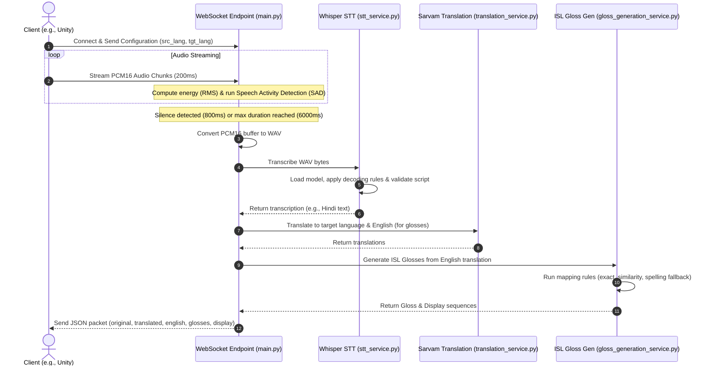

# ConverseNow Backend

ConverseNow is a real-time assistive translation and sign language interpretation system. The backend is a Python-based FastAPI service designed to ingest streaming audio (e.g., from a client like Unity), perform Speech-to-Text (STT), translate the text, and generate Indian Sign Language (ISL) gloss sequences to drive avatar animations.

---

## 🏗️ System Architecture & Workflow

The backend operates as an event-driven, real-time pipeline over WebSockets. Here is how audio flows from the client through the backend:



---

## 📂 Codebase Breakdown

The codebase is structured cleanly into modular services:

### 1. 🚀 Entry Point: `main.py`
Exposes the FastAPI application and coordinates the WebSocket and HTTP APIs.
* **WebSocket Endpoint (`/ws/audio`)**:
  * Receives configuration details (source and target languages).
  * Ingests 200ms chunks of raw PCM16 audio (16kHz, mono, 2-byte width).
  * Computes root-mean-square (RMS) energy to run a **Speech Activity Detector (SAD)** with an energy threshold of `1100`.
  * Finalizes an utterance when it encounters `800ms` of silence after at least `800ms` of active speech, or when the utterance hits a maximum duration of `6000ms`.
  * Orchestrates the transcription, translation, and gloss generation pipeline.
* **REST API Endpoint (`/api/gloss`)**:
  * Provides a HTTP POST endpoint to generate ISL glosses and coverage statistics for a given block of text.

### 2. 🎙️ Speech-to-Text Service: `stt_service.py`
Leverages OpenAI's Whisper model (defaulting to the `"small"` model, customizable via the `WHISPER_MODEL` environment variable) running locally.
* **Language-Specific Prompts**: Primes non-English transcriptions using script-native templates (e.g., Devanagari script for Hindi) to steer the model towards high-quality orthography.
* **Enhanced Decoding Parameters**: Dynamic options such as adjusting temperature, beam size, no-speech, and logprob thresholds depending on whether the source is English or an Indic script.
* **Indic Text Validator**: Runs checks against Unicode ranges corresponding to specific regional scripts (Devanagari, Telugu, Tamil, Malayalam, Kannada, etc.). Transcriptions are rejected as noise/garbage if they contain pure ASCII when an Indic language was expected, or if less than 70% of non-ASCII characters belong to the script range.

### 3. 🌐 Translation Service: `translation_service.py`
Wraps the SarvamAI REST client API using the `sarvam-translate:v1` model.
* Translates text between regional Indian languages and English.
* Implements runtime client state caching. If the `SARVAM_API_KEY` is missing or if the API returns a authentication error (`ForbiddenError`), the service gracefully disables itself and falls back to returning the source text to prevent performance degradation.

### 4. 👐 Sign Language Gloss Generator: `gloss_generation_service.py`
Translates English text into sequences of Indian Sign Language (ISL) glosses. The glosses match a predefined dictionary of available avatar animations inside Unity.
* **Available Glosses (`AVAILABLE_GLOSSES`)**: A dictionary representing 52 core animations (e.g., `"hello"`, `"hospital"`, `"monday"`, `"work"`) and alphabet characters (`"C"`, `"I"`, `"L"`, `"U"`).
* **Stop Word Elimination**: Filters out grammatical syntax that does not carry semantic weight in sign language (e.g., `"is"`, `"the"`, `"to"`, `"and"`).
* **Cascade Mapping Heuristics**:
  1. **Exact Dictionary Match**: Translates words directly if they are registered.
  2. **Substring Mapping**: Matches parts of compound words (e.g., `"goodbye"` matching `"bye"`).
  3. **Similarity Fallback**: Uses `difflib.SequenceMatcher` with a strict score threshold of `0.75` to map similar terms.
  4. **Fingerspelling Fallback**: If no semantic animation is found, the word is spelled out character-by-character using alphabet animations (e.g., `"Aditya"` -> `["A", "D", "I", "T", "Y", "A"]`).
* **Confidence Metrics**: Calculates the percentage of words mapped directly (coverage) versus words that fell back to spelling or remained unmapped.

---

## 🧪 Testing Suite

The project includes two standalone testing files that validate system behavior offline:

* **`test_whisper_indic.py`**:
  * Tests the Indic script Unicode validators against valid scripts, garbled characters, and ASCII inputs.
  * Validates the generation of decode option dictionaries.
* **`test_gloss_generation.py`**:
  * Contains assertion tests for word tokenization, punctuation removal, stop word omission, substring matching, fingerspelling fallbacks, coverage estimation, and edge cases (numbers, empty payloads).

To run the tests:
```powershell
python test_whisper_indic.py
python test_gloss_generation.py
```

---

## ⚙️ Setup & Execution

### Prerequisites
* Python 3.8+
* [PyTorch](https://pytorch.org/) (for local Whisper inference)
* FFmpeg (required by Whisper for audio processing)

### Installation
1. Clone the repository.
2. Initialize and activate a virtual environment:
   ```powershell
   python -m venv .venv
   .venv\Scripts\Activate.ps1
   ```
3. Install dependencies:
   ```powershell
   pip install -r requirements.txt
   ```

### Running the Server
Set your configuration environment variables and start the server using Uvicorn:
```powershell
# Set your Sarvam AI API Key
$env:SARVAM_API_KEY="your-api-key-here"

# (Optional) Customize the local Whisper model size (tiny, base, small, medium, large)
$env:WHISPER_MODEL="small"

# Start FastAPI
uvicorn main:app --host 0.0.0.0 --port 8000 --reload
```

---

## ✉️ WebSocket Payload Examples

### Client Configuration Message
Send a text packet on connection to configure the session:
```json
{
  "type": "config",
  "src_lang": "hi-IN",
  "tgt_lang": "en-IN"
}
```

### Server Response Payload
When an utterance is finalized, the server returns the compiled response:
```json
{
  "original": "नमस्ते आप कैसे हैं",
  "translated": "Hello, how are you",
  "english": "Hello how are you",
  "glosses": [
    "hello",
    "H",
    "O",
    "W",
    "he"
  ],
  "glosses_display": [
    "HELLO",
    "Fingerspelled-HOW",
    "Fingerspelled-HOW",
    "Fingerspelled-HOW",
    "YOU"
  ],
  "src_lang": "hi-IN",
  "tgt_lang": "en-IN",
  "timestamp": 1718023456.789,
  "final": true
}
```
