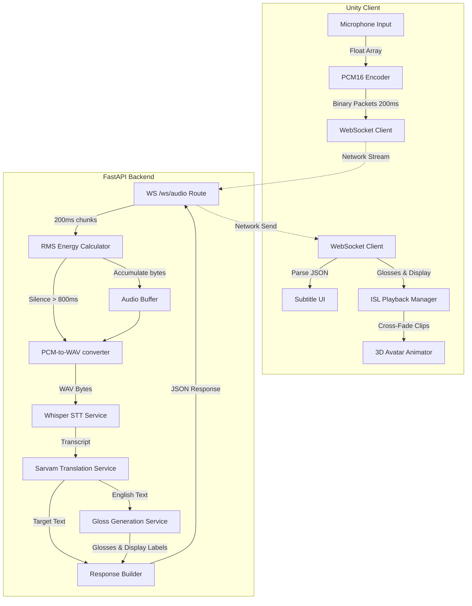
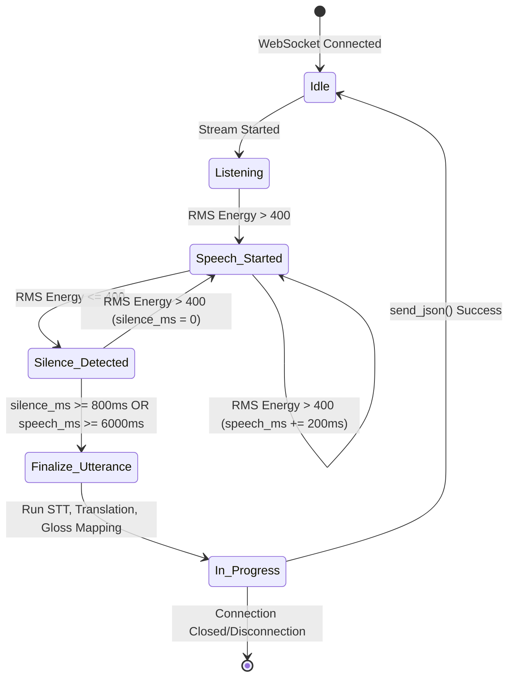
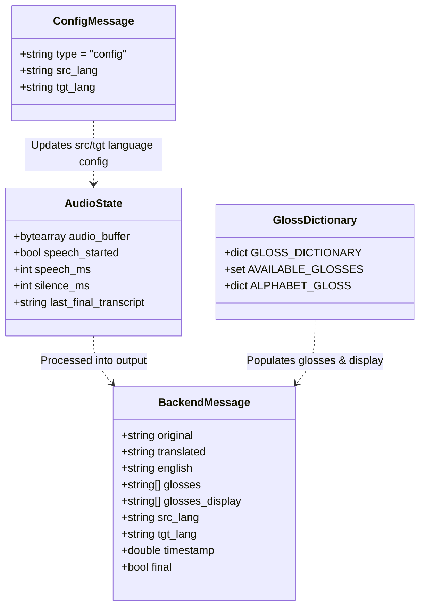

# ConverseNow: System Architecture & Design Document (SADD)

This document provides a detailed breakdown of the ConverseNow architecture, describing components, data flows, state machines, and schemas.

---

## 1. High-Level Data Flow & Pipeline Architecture
The diagram below maps out how raw vocal input from the Unity client is transformed, analyzed, and processed into sign animations.

---

## 2. Speech Activity & Connection State Machine
The backend operates a state-driven WebSocket consumer. The diagram below illustrates how audio segments are identified and sent for translation.

---

## 3. Data Models & JSON Payload Schemas (ER-Equivalent)
Since ConverseNow is a **stateless** translation pipeline, there is no physical SQL/NoSQL database storage. The diagram below represents the logical schema and relationship of the in-memory variables and WebSocket serialization classes.

---

## 4. Component Details (Python Backend)

### A. Entry Router & WebSocket Handler (`main.py`)
* Manages Client WebSocket connections at `/ws/audio`.
* **Speech Activity Detection (SAD)**: Calculates Root Mean Square (RMS) energy on incoming 200ms chunks using `rms_pcm16`.
* **Utterance Segmentation**: Finalizes the buffer when silence is detected for more than `800ms` (following at least `800ms` of active speech) or when the utterance hits a maximum duration of `6000ms`.
* **Async Thread Offloading**: Runs heavy operations (STT, translation, gloss generation) via `asyncio.to_thread` to ensure the main ASGI event loop is never blocked.

### B. Speech-to-Text (`stt_service.py`)
* Wraps the local **OpenAI Whisper** model.
* **Decoding Optimization**: Utilizes language-specific prompt steering (e.g., feeding native script templates as initial prompts) and parameter overrides (beam size, logprob, and no-speech cutoffs) to improve transcription accuracy.
* **Script Verification**: Validates the Unicode block ranges of the output text against the target language to prevent Whisper from outputting ASCII characters/noise in place of native regional scripts.

### C. Translation Service (`translation_service.py`)
* Integrates with the **SarvamAI Translation API** (`sarvam-translate:v1`).
* Translates the transcription to the target language and also to English (used as the base language for sign mapping).
* Implements dynamic API fail-safe caching to gracefully bypass the translation step if the API key is invalid or expires.

### D. Gloss Translation Service (`gloss_generation_service.py`)
* Resolves the English translation into a list of animation names.
* **Stop Word Omission**: Removes words like `"is"`, `"the"`, `"to"` which carry no semantic weight in sign language.
* **Cascading Logic**:
  1. *Exact match* in local dictionary.
  2. *Substring match* (restricted to keys $\ge$ 3 characters).
  3. *Similarity mapping* (using `difflib.SequenceMatcher` with a strict threshold $\ge$ 0.75).
  4. *Fingerspelling fallback*: Spells out unrecognized words character-by-character.
